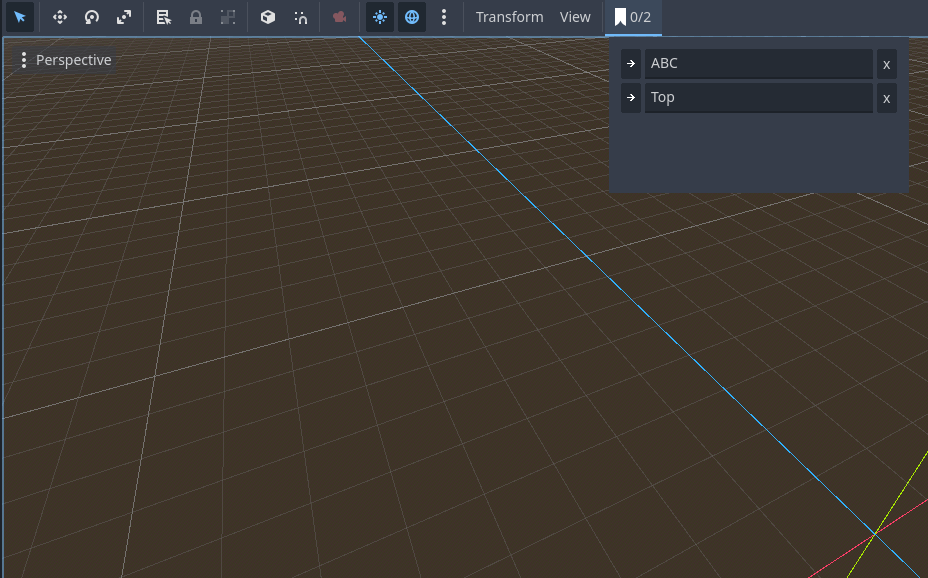

# Camera Bookmarks
An editor plugin that allows you to save viewport camera positions/rotations as bookmarks so you can easily return to that view later.

Click the button to cycle through saved bookmarks

Ctrl click to save current viewport camera as a new bookmark

Right click to see a list of all bookmarks. Here you can rename, delete, or jump to a specific bookmark.

Ctrl Shift Click creates a Camera3D node at the current viewport camera 

### Installation Instruction
1. Copy the plugin to you res://addons/ folder
2. Go to ProjectSettings->Plugins and activate CameraBookmarks

